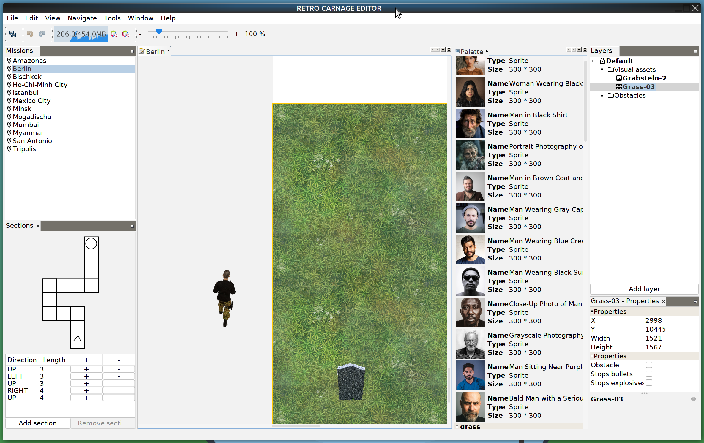

# RETRO CARNAGE EDITOR

A level editor for [Retro-Carnage](https://github.com/huddeldaddel/retro-carnage).

Here you can see the current state of the editor. It's based on the [NetBeans](https://netbeans.apache.org/) platform -
so you can rearrange the windows as you like.

The tool windows on the left are used to select the mission you want to
work on. Each mission consists of different sections - building the path that the player has to walk.

In the center area you can see a part of the "Berlin" mission with a player model for size comparison. You can drag and
drop visual elements from the palette to onto the mission and move / resize the elements at any time.

All visual elements are organized in layers. You can show / hide or lock / unlock layers with their content to focus on
specific parts of the mission. The Layer window on the right provides easy access to these layers.

Each element of the mission has various properties. These properties can be edited in the Properties window.

## Getting the latest release

You can find the latest release of the Retro-Carnage-Editor on the [downloads](https://www.retro-carnage.net/downloads/) page of the [Retro-Carnage website](https://www.retro-carnage.net).

## Getting Started

### Prerequisites

First of all, you should install the necessary tools on your computer to be able to work with the source code. You will need [git](https://git-scm.com/), [Java](https://openjdk.org/), and [NetBeans](https://netbeans.apache.org). 

### Get and build the source code

Get the code and assets

`git clone https://github.com/Retro-Carnage-Team/retro-carnage-editor.git`  

Change into the src directory

`cd retro-carnage-editor`

Open the project folder in NetBeans

`netbeans .`

NetBeans should now have the project open for you. You can right click on the project in the "Projects" view on the left. Select "Clean and Build" from the context menu. To start the editor press F6.

## Running the tests

Run the steps to install the development environment first (see previous chapter). Then press Alt+F6 to run the tests.

## Authors

- **[Thomas Werner](https://github.com/huddeldaddel)**

## License

This project is licensed under the MIT License. See the [LICENSE.md](./LICENSE.md) file for details.
