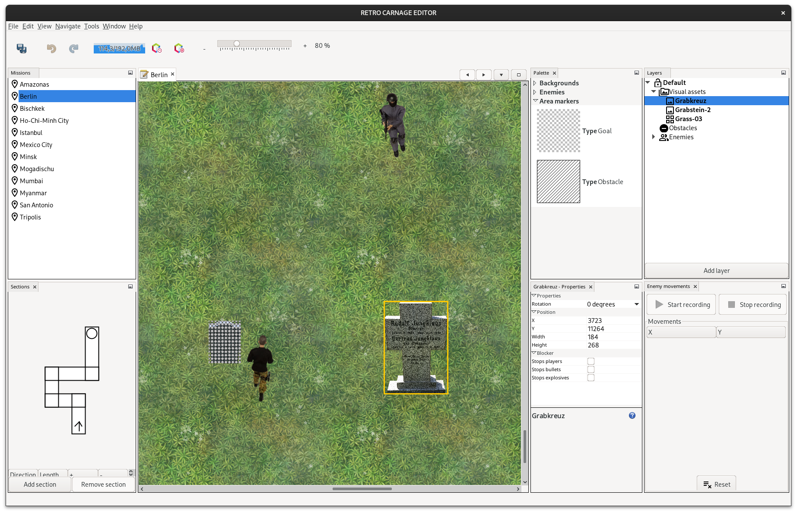

  

# RETRO CARNAGE EDITOR

A level editor for [Retro-Carnage](https://github.com/huddeldaddel/retro-carnage).

This screenshot shows the mission selection (left / top), a mini-map of the mission structure (left / bottom), and the level itself being opened in the editor (right). Working with the level content is work on progress.

The Asset Manager can be used to manage the assets used in various levels. It can manage visual assets and background music. For each asset you can record the required license information. Later an attribution page will be auto-generated for each mission.

The Mission Manager is similar to the Asset Manager. You can use it to manage the meta data of a mission - like the description, it's location on the map and so on. 